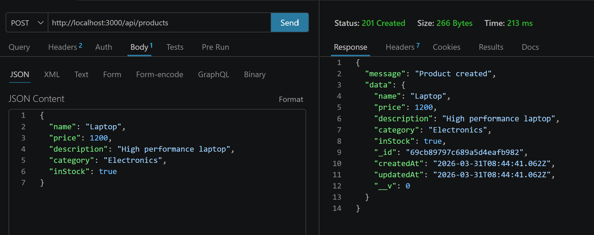
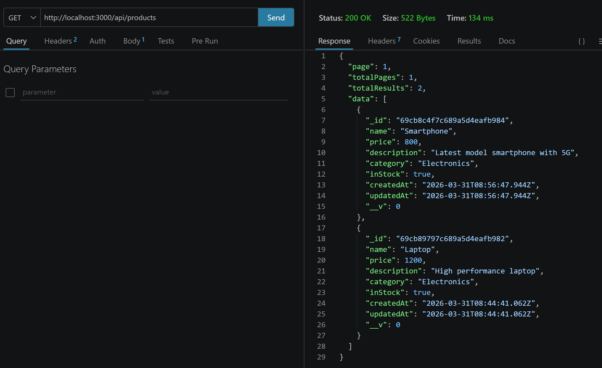
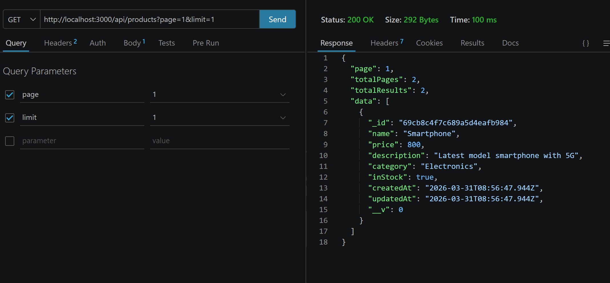
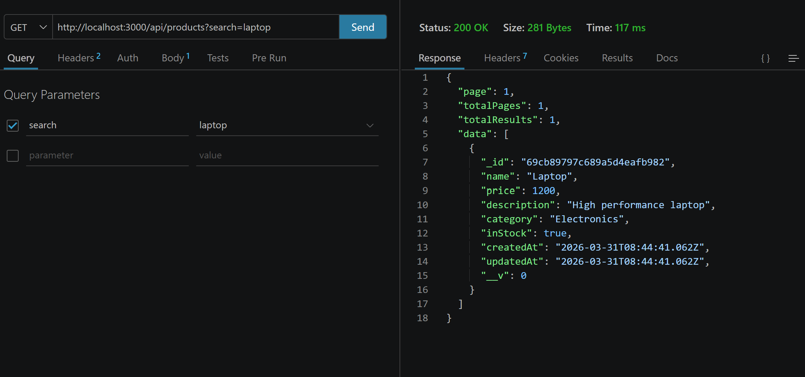
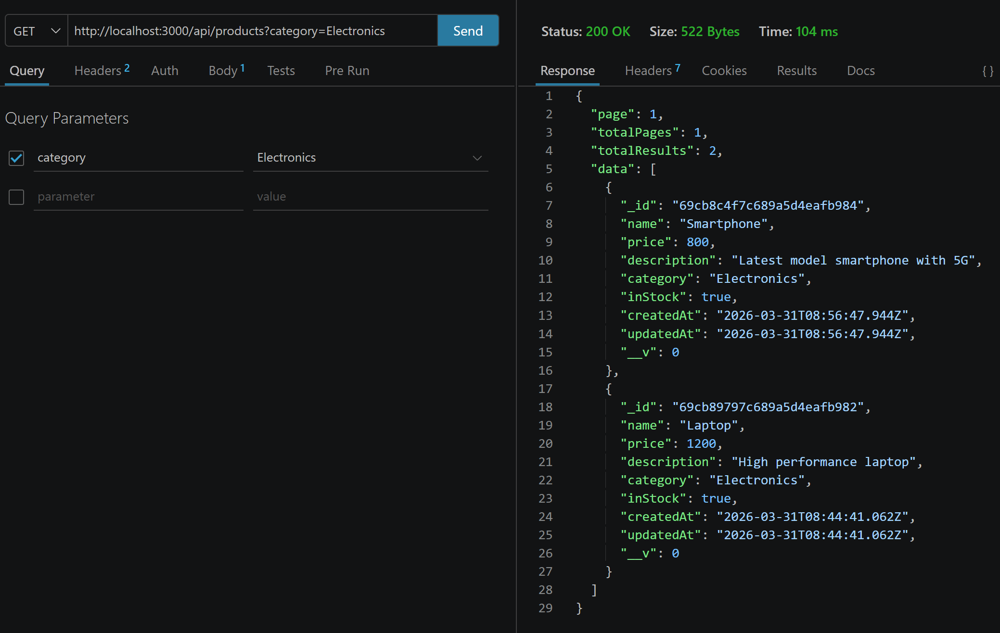
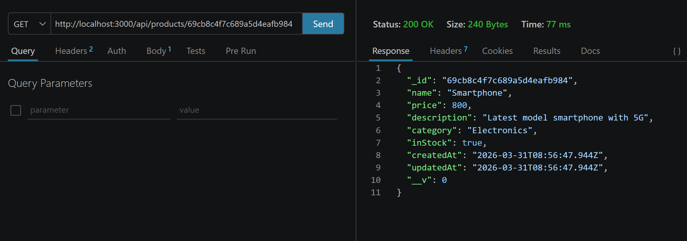
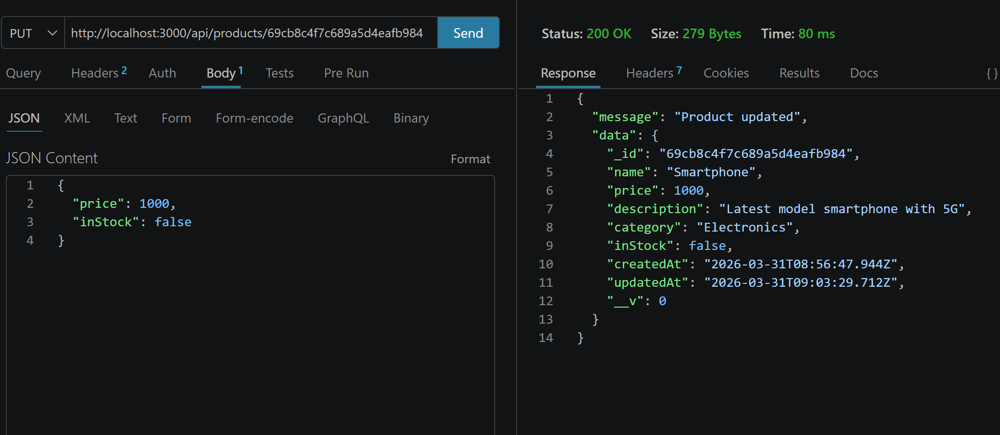
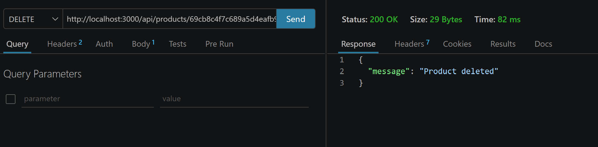

# E-commerce Catalog API

## Overview
This project is a backend API for managing products in an online store.  
It supports CRUD operations (Create, Read, Update, Delete), pagination, sorting, search, validation, and error handling.

## Setup
1. Clone the repository:
   git clone https://github.com/Cabby4/ecommerce-catalog-api.git
   cd ecommerce-catalog-api
   
2. Install dependencies:
   npm install
   
3. Create a `.env` file in the root directory:
   MONGODB_URI=your_mongo_connection_string
   PORT=3000
   
4. Run locally:
   npm run dev
   

## API Endpoints
- **POST /api/products** → create a product  
- **GET /api/products** → list products (supports pagination, sorting, search, category filter)  
- **GET /api/products/:id** → get a single product by ID  
- **PUT /api/products/:id** → update a product  
- **DELETE /api/products/:id** → delete a product  

### Example Request

GET /api/products?page=1&limit=5&sort=price&search=laptop&category=Electronics

## Features
- Pagination (`?page=1&limit=10`)
- Sorting (`?sort=price`)
- Search (`?search=keyword`)
- Category filter (`?category=Electronics`)
- Validation with Joi
- Error handling middleware
- Request logging middleware

## Deployment
Live API URL (Render):  https://ecommerce-catalog-api-u979.onrender.com

## Testing
All endpoints were tested manually using Thunder Client.

### Screenshots
- **Create Product**  
  

- **Get Products**  
  

- **Pagination**  
  

- **Search**  
  

- **Filter by Category**  
  

- **Get Single Product**  
  

- **Update Product**  
  

- **Delete Product**  
  

---
